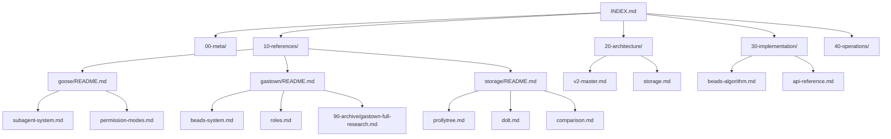

# Document Map

This map outlines the relationships between key documents in the OpenGoose documentation.

## Key Flows

1. **Architecture Flow**: `v2-master.md` defines the high-level goals, which are implemented via `beads-algorithm.md` and supported by `storage.md`.
2. **Goose Integration**: `goose-integration.md` (in architecture) links the core `goose/README.md` concepts to OpenGoose v2.
3. **Research to Implementation**: `gastown-full-research.md` provided the inspiration for the roles in `roles.md` and the system in `beads-system.md`.
