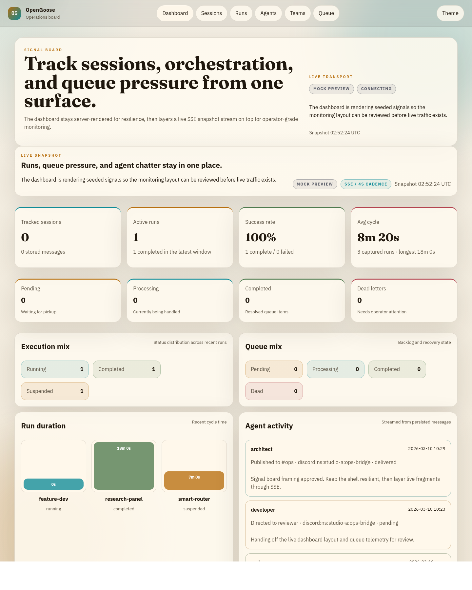
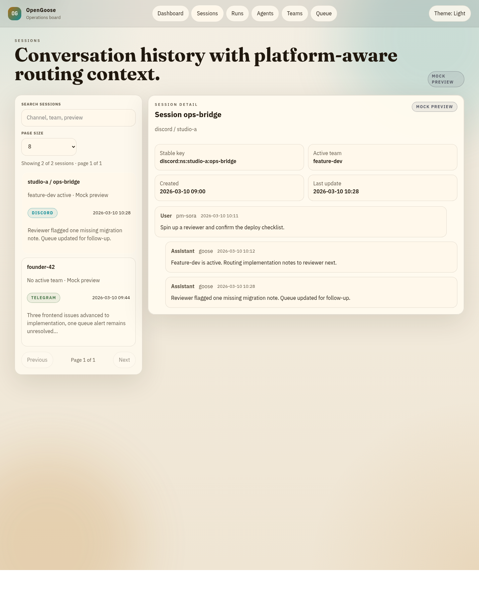
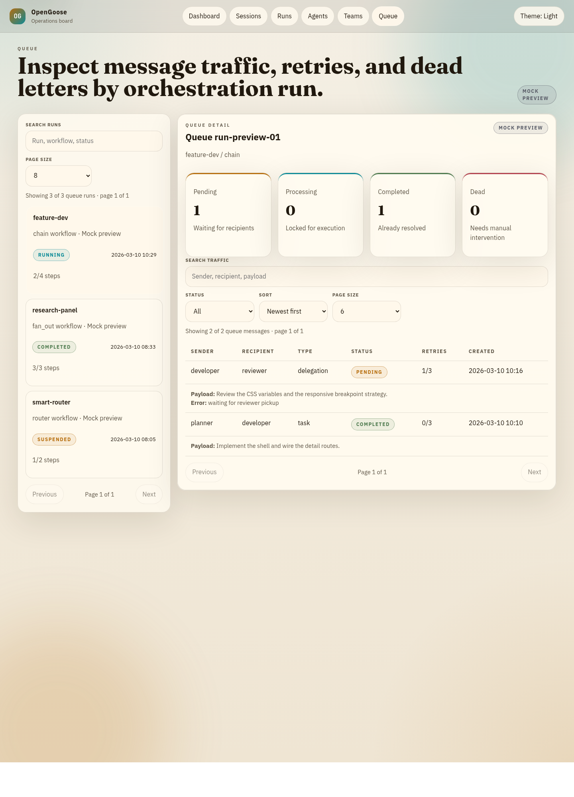

# OpenGoose Web Dashboard Guide

## Launch

Start the dashboard from the repo root:

```bash
opengoose web --port 8080
```

Open `http://127.0.0.1:8080`.

## What the dashboard covers

The dashboard stays server-rendered and adds live updates only where they help operators:

- `Dashboard`: live SSE snapshot of recent sessions, runs, queue pressure, and agent activity.
- `Sessions`: conversation history with a searchable session rail and query-selected detail view.
- `Runs`: orchestration status, work items, and broadcasts for a selected run.
- `Agents`: installed agent profiles, extensions, skills, and YAML.
- `Teams`: editable team definitions with inline validation and save feedback.
- `Queue`: searchable queue traffic with client-side filtering, sorting, and pagination.

## Interaction model

The web layer stays intentionally split:

- `Askama` renders full pages and live patch fragments.
- `Datastar` opens the live event streams and patches the DOM in place.
- `assets/app.js` is limited to local-only enhancements such as theme, searchable rails, and sortable tables.

### Search and paging

- The left rail on `Sessions`, `Runs`, `Agents`, `Teams`, and `Queue` includes search and page-size controls.
- Filters apply client-side so operators can narrow the current page without a full refresh.
- Pager controls keep the rail compact even when the catalog grows.

### Keyboard support

- Use `Tab` to move between controls, navigation, and the detail panel.
- On a focused rail item, use `ArrowUp`, `ArrowDown`, `Home`, and `End` to move through visible entries.
- On a focused queue row, use the same keys to move through visible message rows.
- A skip link jumps directly to the main content region.

### Loading and error feedback

- Live pages surface Datastar stream state directly in the hero status area.
- SSE reconnects fall back to a slower reconciliation sweep so time-based labels keep moving even when the event stream is quiet.
- Validation and save feedback stay server-rendered inside the selected detail pane.

## Smoke check

After starting the web server, run:

```bash
./scripts/web-smoke.sh http://127.0.0.1:8080
```

That verifies the main HTML routes, vendored Datastar asset references, and the
initial `datastar-patch-elements` handshake on the live SSE endpoints.

## Screenshots

### Dashboard overview



### Sessions rail and detail panel



### Queue controls and sortable table


